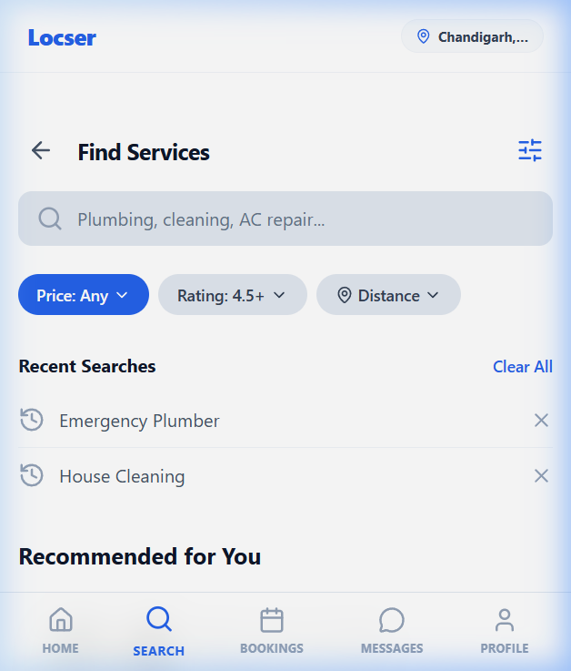
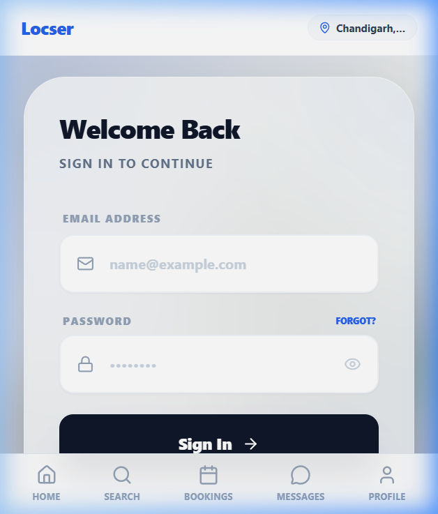
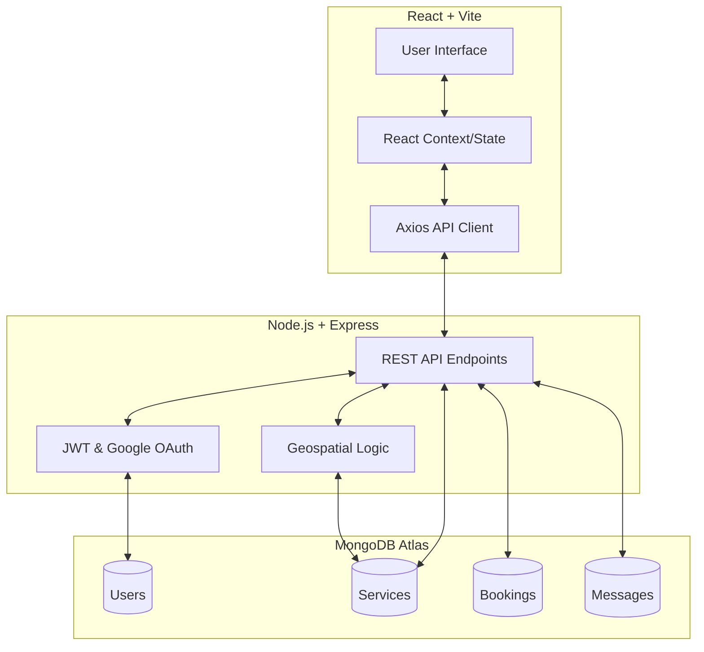

# 🛠️ Locser: Local Professional Services Marketplace

**Locser** is a full-stack marketplace platform designed to connect consumers with local professional service providers. Whether it's plumbing, cleaning, or tutoring, Locser makes it easy to find, book, and communicate with top-rated professionals in your area.

---

## 📸 Screenshots

| Home Page | Search & Discovery |
| :---: | :---: |
|  |  |

| Service Details | Secure Login |
| :---: | :---: |
|  |  |

---

## ✨ Key Features

### 👤 For Consumers
- **Geospatial Search:** Find professionals within a specific radius using MongoDB's `2dsphere` indexing.
- **Service Categories:** Browse services across various domains (Cleaning, Electrician, Yoga, etc.).
- **Smart Booking:** Real-time slot selection with automatic double-booking prevention.
- **Secure Auth:** Support for traditional Email/Password and **Google One-Tap Login**.
- **Integrated Chat:** Communicate directly with providers to discuss requirements.

### 💼 For Service Providers
- **Listing Management:** Full CRUD operations for service listings.
- **Earnings Dashboard:** Real-time tracking of earnings with automated platform fee and tax calculations.
- **Booking Management:** Accept, track, and update the status of incoming service requests.

---

## 🏗️ Architecture



---

## 🚀 Tech Stack

- **Frontend:** React 19, Vite, React Router 7, TailwindCSS, Lucide Icons, Leaflet (Maps).
- **Backend:** Node.js, Express 5, Mongoose 9.
- **Database:** MongoDB (with Geospatial Indexing).
- **Security:** JWT, BcryptJS, Google OAuth 2.0.

---

## 🛠️ Setup & Installation

### Prerequisites
- Node.js (v18+)
- MongoDB Atlas account or local instance

### 1. Clone the repository
```bash
git clone https://github.com/your-username/locser.git
cd locser
```

### 2. Backend Configuration
Navigate to the `backend` folder and create a `.env` file:
```bash
cd backend
npm install
```
Add the following to `.env`:
```env
PORT=3000
MONGODB_URI=your_mongodb_connection_string
JWT_SECRET=your_jwt_secret
GOOGLE_CLIENT_ID=your_google_client_id
```
Start the backend:
```bash
npm start
```

### 3. Frontend Configuration
Navigate to the `website` folder and install dependencies:
```bash
cd ../website
npm install
```
Start the development server:
```bash
npm run dev
```

---

## 📂 Project Structure

```text
├── backend/            # Express server & MongoDB models
│   ├── models/         # Mongoose schemas
│   ├── server.js       # Main API entry point
│   └── .env            # Environment variables
├── website/            # React + Vite frontend
│   ├── src/
│   │   ├── components/ # Reusable UI components
│   │   ├── pages/      # Main application pages
│   │   └── utils/      # Helpers & API config
├── screenshots/        # UI screenshots for documentation
└── README.md           # You are here!
```

---

## 🤝 Contributing
Contributions are welcome! Please feel free to submit a Pull Request.

## 📄 License
This project is licensed under the ISC License.
